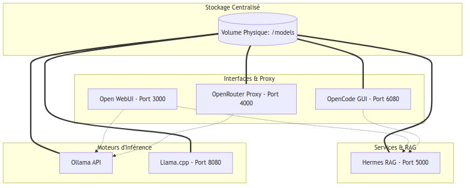

# IA Locale, Open Source et Agents RAG 🚀 (Version Stack Podman)

Présentation technique réalisée pour **3W Québec** à l'**UQAM** le **23 Avril 2026**.

## 📝 Description du Projet
Infrastructure IA modulaire et souveraine. Chaque service est un conteneur Podman indépendant, tous reliés à un dossier de modèles centralisé et un réseau privé.

## 🏗️ Schéma d'Architecture Global

<p align="center">
  
</p>

> **Souveraineté :** L'accès direct au volume `/models` (représenté par les lignes pleines `===`) garantit que chaque outil travaille sur la même base de connaissance locale sans duplication.

## 🛠️ Détail des Services
- **Ollama, Llama.cpp, Hermes RAG, OpenCode, OpenRouter** : Tous sont configurés avec un montage de volume sur le dossier des modèles de l'hôte.
- **Open WebUI** : Sert de point d'entrée unique pour l'interaction utilisateur.


## 🚀 Lancement Rapide
```bash
cd "votre-dossier-de-travail¨ 
podman-compose up -d
```
Visualisation système : [http://localhost:9090](http://localhost:9090) (Cockpit)

---
*Architecture optimisée pour le partage de ressources locales.*
